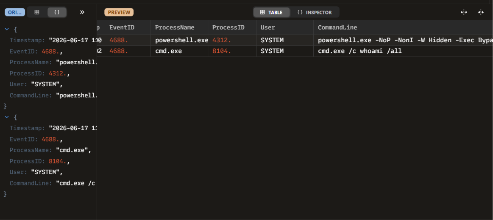

# INC-002: Malicious PowerShell Execution Analysis

### 🛡️ Triage Summary
On 2026-06-17, an endpoint monitoring alert flagged a suspicious process creation event (Event ID 4688) on a critical network asset. An administrative user account executed an obfuscated, non-interactive PowerShell command designed to bypass execution policies and download fileless malware from external adversary infrastructure.

### 🔍 Indicators of Compromise (IOCs)
| Indicator Type | Value / Parameters | Context / Purpose |
| :--- | :--- | :--- |
| **Process Name** | `powershell.exe` (PID: 4312) | Initial execution vector |
| **Bypass Flags** | `-NoP -NonI -W Hidden -Exec Bypass` | Suppresses profile, user window, and execution restrictions |
| **Malicious Utility**| `IEX (Invoke-Expression)` | Forces direct in-memory string execution |
| **Network Callout** | `http://104.244.42.1/payload.ps1` | Pulls secondary fileless script payload |
| **Discovery Process**| `cmd.exe /c whoami /all` (PID: 8104) | Automated privilege and group membership reconnaissance |

### 🛑 Containment & Remediation Playbook
1. **Process Termination:** Terminated active process trees for PID `4312` and PID `8104` via EDR.
2. **Memory Dump Collection:** Captured a volatile memory dump of the endpoint prior to isolation to preserve the in-memory `payload.ps1` binary for reverse engineering.
3. **Network Isolation:** Isolated the host from the local domain segment to stop lateral reconnaissance.
4. **Credential Audit:** Rotated local administrator passwords across the organizational unit due to the `SYSTEM` context execution.

### 🖼️ Evidence & Artifacts
Below is the high-fidelity process log audit captured inside Zui:

