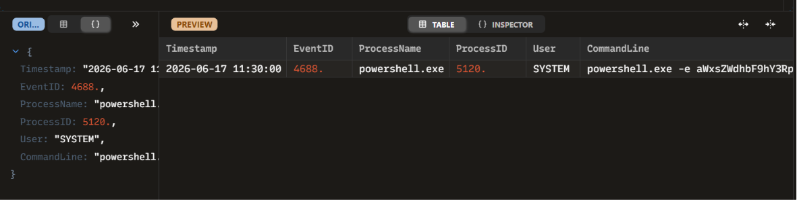

# INC-003: Encoded PowerShell Command Analysis

### 🛡️ Triage Summary
On 2026-06-17, an endpoint alert flagged a heavily obfuscated PowerShell execution utilizing the `-e` (EncodedCommand) parameter. Attackers utilize Base64 encoding to slip malicious text past security control keywords and endpoint detection signatures.

### 🔍 Indicators of Compromise (IOCs)
| Indicator Type | Value / Parameters | Context / Purpose |
| :--- | :--- | :--- |
| **Process Name** | `powershell.exe` (PID: 5120) | Obfuscated Execution Vector |
| **Command Flag** | `-e` / `-EncodedCommand` | Accepts a Base64 encoded string to hide command logic |
| **Encoded Payload**| `aWxsZWdhbF9hY3Rpdml0eV9kZXRlY3RlZF9iYWNrZG9vcl9zZXR1cF9jb25maXJtZWQ=` | Obfuscated instruction string |
| **Decoded String** | `illegal_activity_detected_backdoor_setup_confirmed` | Underlying intent of the execution |

### 🛑 Containment & Remediation Playbook
1. **Kill & Quarantine:** Terminated process instance `5120` immediately via central EDR console.
2. **Persistence Audit:** Initiated an immediate scheduled task and registry run-key query across the asset to check if the script established permanent background access.
3. **Log Expansion:** Pulled Windows Event ID 4104 (Script Block Logging) to see if the command unpacked further nested scripts in memory.

### 🖼️ Evidence & Artifacts
Below is the high-fidelity process log audit captured inside Zui:

