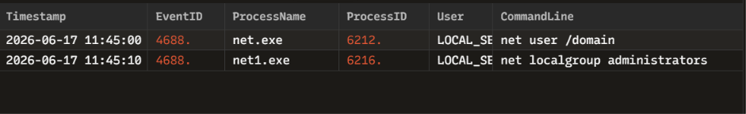

# INC-004: Local and Domain User Discovery Analysis

### 🛡️ Triage Summary
On 2026-06-17, an active endpoint alert flagged a sequence of reconnaissance commands (Event ID 4688) executed rapidly from a non-administrative account context. The adversary utilized the native Windows network utility to enumerate domain user accounts and map out local administrative group memberships.

### 🔍 Indicators of Compromise (IOCs)
| Indicator Type | Value / Parameters | Context / Purpose |
| :--- | :--- | :--- |
| **Process Name** | `net.exe` / `net1.exe` | Native Windows network binary used for administrative enumeration |
| **Recon Command 1**| `net user /domain` | Enumerates all user accounts across the active Active Directory domain |
| **Recon Command 2**| `net localgroup administrators` | Identifies all users assigned elevated local administrative privileges |
| **Context Account**| `LOCAL_SERVICE` | Indicates command execution stemmed from a hijacked or exploited background service |

### 🛑 Containment & Remediation Playbook
1. **Account Session Termination:** Invalidated active tokens and force-killed the running session tied to the executing process tree.
2. **Privileged Group Monitoring:** Initiated an active watch on the localized `Administrators` group for unauthorized new member additions.
3. **SIEM Rule Tuning:** Configured a behavioral alert correlation rule to trigger an immediate Tier-2 notification if any host executes `net.exe` reconnaissance arguments more than twice within a 60-second window.

### 🖼️ Evidence & Artifacts
Below is the high-fidelity process log audit captured inside Zui:

