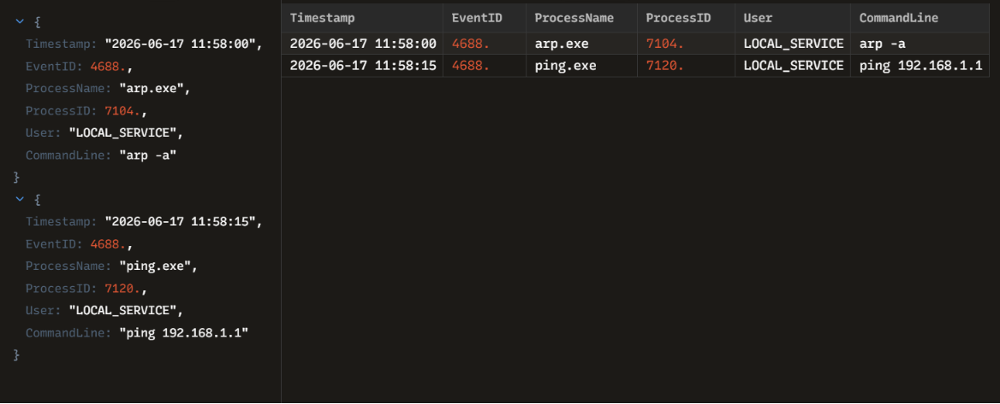

# INC-005: Internal Network Discovery and Reconnaissance Analysis

### 🛡️ Triage Summary
On 2026-06-17, an active endpoint alert flagged a series of network reconnaissance commands (Event ID 4688) executed from a compromised local service account. The adversary utilized native Windows network utility tools to map out local ARP tables and verify connectivity to the network's default gateway, a common precursor to lateral movement.

### 🔍 Indicators of Compromise (IOCs)
| Indicator Type | Value / Parameters | Context / Purpose |
| :--- | :--- | :--- |
| **Process Name** | `arp.exe` / `ping.exe` | Native Windows utilities abused for network infrastructure discovery |
| **Recon Command 1**| `arp -a` | Displays the current ARP cache tables to discover active neighboring IP and MAC addresses |
| **Recon Command 2**| `ping 192.168.1.1` | Sends ICMP echo requests to verify connectivity to the subnet gateway |
| **Context Account**| `LOCAL_SERVICE` | Indicates unauthorized execution stemming from an exploited system process tree |

### 🛑 Containment & Remediation Playbook
1. **Network Segmentation:** Temporarily restricted the asset's outbound broadcast and ICMP traffic at the host firewall level to block active internal scanning.
2. **Process Termination:** Force-killed active network discovery process handles running under PID `7104` and `7120`.
3. **EDR Watchlist Rule:** Applied an EDR custom detection rule to automatically isolate any non-administrative workstation executing successive `arp` cache dumps or rapid ping sweeps.

### 🖼️ Evidence & Artifacts
Below is the high-fidelity process log audit captured inside Zui:

