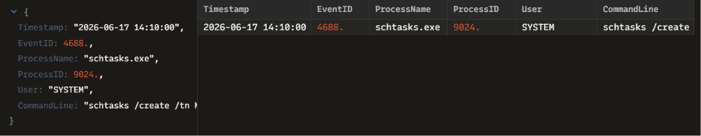

# INC-006: Scheduled Task Persistence Mechanism Analysis

### 🛡️ Triage Summary
On 2026-06-17, an active endpoint alert flagged an unauthorized modification to the system's scheduled tasks framework (Event ID 4688). The adversary abused the native Windows `schtasks.exe` utility under an elevated administrative context to register a recurring task disguised as a legitimate Windows update service to maintain long-term persistence.

### 🔍 Indicators of Compromise (IOCs)
| Indicator Type | Value / Parameters | Context / Purpose |
| :--- | :--- | :--- |
| **Process Name** | `schtasks.exe` (PID: 9024) | Native utility abused to register tasks |
| **Task Name (`/tn`)**| `Microsoft\Windows\UpdateService` | Masquerading technique used to blend into legitimate Windows directories |
| **Task Run (`/tr`)** | `powershell.exe -WindowStyle Hidden...` | Launches an hidden in-memory malicious secondary payload |
| **Trigger (`/sc` / `/mo`)**| `hourly` / `1` | Configures the task to force re-infection logic every single hour |

### 🛑 Containment & Remediation Playbook
1. **Task Deletion:** Executed `schtasks /delete /tn "Microsoft\Windows\UpdateService" /f` via emergency remote shell to completely purge the persistence hook.
2. **File Quarantine:** Isolated and removed the staging script located at `C:\Users\Public\update.ps1`.
3. **Registry Verification:** Audited the `HKLM\SOFTWARE\Microsoft\Windows NT\CurrentVersion\Schedule\TaskCache\Tree` registry path to confirm no orphaned task elements remained.

### 🖼️ Evidence & Artifacts
Below is the high-fidelity process log audit captured inside Zui:

