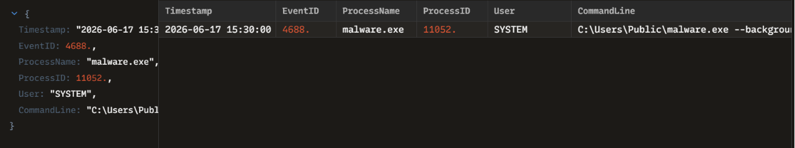

# INC-009: Dropped Malware Execution and Process Triage

### 🛡️ Triage Summary
On 2026-06-17, an advanced endpoint defense rule triggered on a high-risk process creation event (Event ID 4688). An unverified binary, previously dropped into a public directory, was executed under full system privileges with runtime arguments indicating an intentional shift into hidden background operations.

### 🔍 Indicators of Compromise (IOCs)
| Indicator Type | Value / Parameters | Context / Purpose |
| :--- | :--- | :--- |
| **Process Name** | `malware.exe` (PID: 11052) | Active untrusted binary execution |
| **Execution Path**| `C:\Users\Public\malware.exe` | Staged out of a world-writable directory to bypass user access restrictions |
| **Process Flag**  | `--background` | Suppresses user interface to execute quietly as a stealth service |
| **Context Account**| `SYSTEM` | Grants full administrative control over the localized operating system core |

### 🛑 Containment & Remediation Playbook
1. **EDR Host Isolation:** Immediately triggered a logical network isolation of the host workstation through the EDR management console to block command-and-control communication.
2. **Process Terminate-and-Ban:** Killed active PID `11052` and blocked the file hash organization-wide to prevent execution on other endpoints.
3. **Directory Lock:** Deployed a global group policy adjustment to restrict binary execution rights out of `C:\Users\Public\` and `C:\Windows\Temp\` folders for standard users.

### 🖼️ Evidence & Artifacts
Below is the high-fidelity process log audit captured inside Zui:

