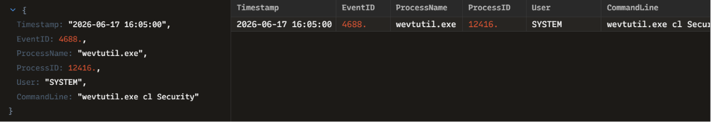

# INC-010: Proactive Threat Hunt and Anti-Forensics Defense Evasion Analysis

### 🛡️ Triage Summary
On 2026-06-17, a proactive threat hunting query targeting anti-forensics behaviors flagged a critical defense evasion event (Event ID 4688). An administrative process initiated the native Windows event utility tool to completely clear out the local security event logs (`Security`), a high-confidence signal indicating an adversary trying to destroy their operational trail.

### 🔍 Indicators of Compromise (IOCs)
| Indicator Type | Value / Parameters | Context / Purpose |
| :--- | :--- | :--- |
| **Process Name** | `wevtutil.exe` (PID: 12416) | Native Windows Event Log utility |
| **Execution Flag**| `cl` / `clear-log` | Triggers the permanent erasure of the specified log repository |
| **Target Log**    | `Security` | Purges authentication, privilege use, and auditing events to blind investigators |
| **Context Account**| `SYSTEM` | Core machine privilege level used to bypass standard auditing restrictions |

### 🛑 Containment & Remediation Playbook
1. **Host Quarantine:** Isolated the host immediately from the network to preserve volatile memory before the adversary could commit further destructive acts.
2. **Central SIEM Audit:** Cross-referenced the SIEM data lake to recover events forwarded over the network *before* the local log channel was purged.
3. **Immutability Enforcement:** Confirmed Windows Event Forwarding (WEF) subscription health to guarantee future log manipulation at the endpoint level cannot delete telemetry stored on remote SIEM indexers.

### 🖼️ Evidence & Artifacts
Below is the high-fidelity process log audit captured inside Zui:

